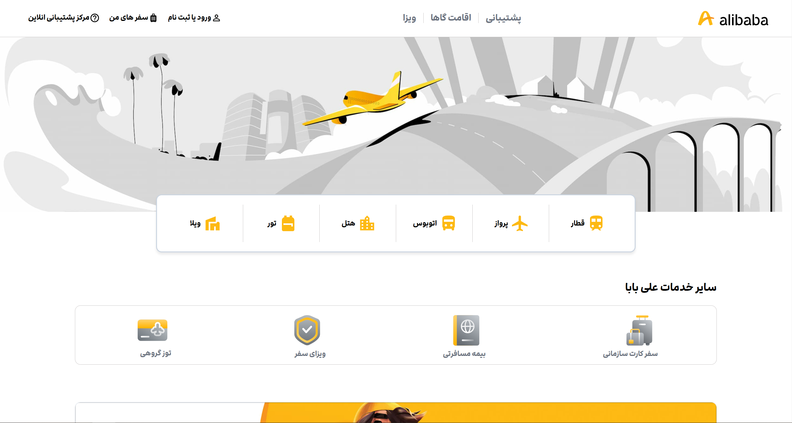

# **Ali Baba Clone**

[](https://reactjs.org/)  
[](https://tailwindcss.com/)  
[](https://reactrouter.com/)  
[](https://mui.com/)  

A responsive, user-friendly web application built with **React**, styled with **TailwindCSS**, and powered by **React Router** for seamless navigation. The project is a clone of the **Ali Baba** website, designed to closely resemble its user interface and experience. It includes **Material-UI Icons** for elegant visual elements and a sleek user interface.

---

## **Table of Contents**
1. [About the Project](#about-the-project)
2. [Features](#features)
3. [Technologies Used](#technologies-used)
4. [Installation](#installation)
5. [Usage](#usage)
6. [Project Preview](#project-preview)
7. [Folder Structure](#folder-structure)
8. [Contributing](#contributing)
9. [License](#license)

---

## **About the Project**

This project is a clone of the **Ali Baba** website, developed to give users a similar design and experience to the original site. Built using modern web technologies like **React**, **TailwindCSS**, and **React Router**, this project provides an elegant and responsive user interface that mirrors Ali Baba's core functionality.  
Key features include:
- **Responsive design** optimized for mobile, tablet, and desktop screens.
- **Dynamic routing** with React Router for seamless page transitions.
- **Elegant icons** with Material-UI to enhance the user experience.
- **Reusable components** for efficient and modular development.

---

## **Features**
- **Routing:** Smooth navigation between pages with React Router.
- **Responsive Design:** Optimized for mobile, tablet, and desktop views using TailwindCSS.
- **Icons:** Professional-grade icons provided by Material-UI Icons.
- **UI Similarity:** Designed to closely resemble the Ali Baba website's layout and design.
- **Performance Optimization:** Fast loading times with optimized assets.

---

## **Technologies Used**
- **React**: Component-based JavaScript library for building user interfaces.
- **TailwindCSS**: Utility-first CSS framework for creating responsive and customizable designs.
- **React Router**: Declarative routing library for handling navigation in React applications.
- **Material-UI Icons**: Pre-designed icons used to enhance the user interface.
- **JavaScript (ES6+)**: For dynamic functionality and performance.

---

## **Installation**

To get a local copy of this project up and running, follow these simple steps:

### Prerequisites
Ensure you have the following installed:
- [Node.js](https://nodejs.org/) (v14+)
- [npm](https://www.npmjs.com/) or [yarn](https://yarnpkg.com/)

### Steps
1. Clone the repository:
   ```bash
   git clone https://github.com/yourusername/your-repo-name.git
   ```
2. Navigate to the project directory:
   ```bash
   cd your-repo-name
   ```
3. Install dependencies:
   ```bash
   npm install
   # or
   yarn install
   ```
4. Start the development server:
   ```bash
   npm start
   # or
   yarn start
   ```

---

## **Usage**

1. Open your browser and navigate to `http://localhost:3000`.
2. Explore the features:
   - Navigate through pages with the navbar.
   - Enjoy the responsive design on different devices (mobile, tablet, desktop).
   - Experience the sleek icons and smooth animations.

---

## **Project Preview**

Here’s a preview of the project:



You can check out the live version of this project [here](https://ali-baba-liart.vercel.app/).

---

## **Folder Structure**

Here’s an overview of the project’s folder structure:

```
src/
├── components/       # Reusable UI components
├── pages/            # Page components for routing
├── assets/           # Static files (images, icons, etc.)
├── styles/           # TailwindCSS configurations
├── App.js            # Main application file
├── index.js          # Entry point of the app
```

---

## **Contributing**

Contributions are welcome! To contribute:
1. Fork the repository.
2. Create a new branch for your feature:
   ```bash
   git checkout -b feature/YourFeature
   ```
3. Commit your changes:
   ```bash
   git commit -m "Add YourFeature"
   ```
4. Push the branch:
   ```bash
   git push origin feature/YourFeature
   ```
5. Open a pull request.

---

## **License**

Distributed under the MIT License. See `LICENSE` for more information.

---

## **Acknowledgments**
- [React](https://reactjs.org/)
- [TailwindCSS](https://tailwindcss.com/)
- [React Router](https://reactrouter.com/)
- [Material-UI](https://mui.com/)
- [Shields.io](https://shields.io/) for badges

---
